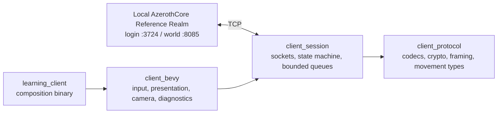

<!-- generated-by: gsd-doc-writer -->

# Miazcore

A private learning project for building a small, original game client that speaks to an AzerothCore Wrath of the Lich King 3.3.5a server.

> **Current status:** the reproducible local AzerothCore Reference Realm is implemented and proven. The production Learning Client is specified but has not yet been implemented. Everything under `.scratch/learning-client/prototypes/` is disposable evidence, not production code.

## What this project is

Miazcore explores game-engine architecture and network protocol implementation through one deliberately narrow vertical slice:

1. authenticate against a real local AzerothCore realm;
2. select a pre-provisioned character;
3. enter the world;
4. render an original placeholder environment;
5. move the character; and
6. prove that the realm saved the submitted position.

The target is called the **World-entry Slice**. It is not an attempt to recreate the World of Warcraft client. The first acceptance platform is macOS on Apple Silicon; the architecture preserves a Windows path for later work.

No Blizzard client installation, data files, terrain, models, audio, or interface assets are required. The client will use project-owned primitives and diagnostic UI.

## Current state

| Area | State | What exists |
| --- | --- | --- |
| Reference Realm | Implemented and proven | A repository-owned, six-service Docker Compose stack with pinned AzerothCore images, deterministic fixture provisioning, health checks, and a real protocol smoke test |
| Protocol contract | Decision-complete | Build-12340 login/world state machines, SRP6, encrypted world headers, character entry, synchronization, self-state decoding, and movement framing |
| Client architecture | Decision-complete | Engine-free protocol and session layers beneath a thin Bevy adapter |
| Diagnostic experience | Prototyped | A disposable browser mock defines the intended viewport, controls, state presentation, and correction feedback |
| Engine/platform path | Prototyped | A disposable Bevy shell renders on Apple Silicon Metal and compile-checks the Windows MSVC target |
| Production Learning Client | Not implemented | The implementation route begins with an offline Bevy Diagnostic World, then adds the real network path capability by capability |

The Reference Realm smoke test currently stops after authenticated character enumeration. It does **not** claim production-client world entry or movement; those are the next implementation frontier.

## Architecture

The intended client keeps protocol correctness independent from rendering and input:



The responsibilities are intentionally strict:

- `client_protocol` owns wire codecs, SRP6 and header crypto, packet framing, and a project-owned AzerothCore movement representation. It has no Bevy or socket dependency.
- `client_session` owns the ordered login/world state machine and blocking sockets on a dedicated thread. It exposes semantic commands, events, and snapshots over bounded channels.
- `client_bevy` owns only player input, prediction/interpolation presentation, placeholder rendering, camera control, and redacted diagnostics.
- `learning_client` composes those layers without hiding protocol or retry behavior.

Control messages use a lossless FIFO with capacity 16 plus a latest-value movement intent. Session output uses a lossless FIFO with capacity 64 plus a latest-value client snapshot. The Bevy side processes systems in the order **Ingress → Input → Presentation → Camera → Diagnostics**.

The selected production baseline is Rust 1.97.1 and Bevy 0.19.0. The disposable engine proof already pins those exact versions.

## Installation

There is no production client binary to install yet. Clone the repository to run the Reference Realm or inspect the prototypes:

```sh
git clone git@github.com:michaelwalloschke/miazcore.git
cd miazcore
```

### Reference Realm prerequisites

On Apple Silicon, the proven host setup is:

- Docker Desktop using the **Apple Virtualization Framework** with **Rosetta** enabled;
- Docker Compose;
- Bash, OpenSSL, and Python 3;
- about 20 GB of free disk; and
- outbound access to Docker Hub and GitHub Releases.

The pinned AzerothCore containers target `linux/amd64`. The QEMU-only Docker Desktop path crashed the pinned worldserver during the feasibility proof; Rosetta is part of the known-good setup.

The first bootstrap downloads an approximately 1.2 GB compressed server-data archive and several container images. The extracted data and databases remain in Docker volumes on the local host.

## Quick start: Reference Realm

Run all commands from the repository root.

1. Create the ignored local secrets:

   ```sh
   infra/azerothcore/realm init-secrets
   ```

2. Pull, initialize, provision, and start the realm:

   ```sh
   infra/azerothcore/realm up
   ```

3. Check orchestration, sockets, realm metadata, and the fixture character:

   ```sh
   infra/azerothcore/realm health
   ```

4. Exercise real build-12340 authentication and character enumeration:

   ```sh
   infra/azerothcore/realm smoke
   ```

5. Stop the realm while retaining its state:

   ```sh
   infra/azerothcore/realm down
   ```

After bootstrap, the local fixture is:

| Property | Value |
| --- | --- |
| Realm ID | `1` |
| Realm name | `Miazcore Reference Realm` |
| Client build | `12340` |
| Account | `MIAZTEST` |
| Character | `Miaztest` |
| Login endpoint | `127.0.0.1:3724` |
| World endpoint | `127.0.0.1:8085` |

The generated account password is stored locally in `infra/azerothcore/secrets/fixture-password`. The helper scripts consume it without printing credentials or session material.

## Reference Realm operations

[`infra/azerothcore/realm`](infra/azerothcore/realm) is the supported entry point for the local environment.

| Command | Effect |
| --- | --- |
| `init-secrets` | Creates or retains four ignored secret files with mode `0600` |
| `up` | Validates configuration, pulls locked images, initializes data and databases, provisions the fixture, starts the servers, and runs health checks |
| `health` | Checks Compose state, both host sockets, realm metadata, account state, and the exact fixture character |
| `smoke` | Performs a real SRP6 login, realm discovery, world authentication, and exact single-character enumeration |
| `down` | Stops and removes service containers while retaining database and server-data volumes |
| `reset-state` | Removes only the labeled database volume, preserves downloaded server data, then boots a fresh realm |
| `reset-all` | Removes both labeled volumes, including downloaded server data, then performs a complete bootstrap |

Both reset commands show the exact target volumes and ask for confirmation. Pass `--yes` only when a non-interactive destructive reset is intentional:

```sh
infra/azerothcore/realm reset-state --yes
```

The reset implementation verifies both the project label and the expected volume-kind label before deletion. It refuses mismatched or unlabeled volumes.

### Configuration

The defaults are local-only. Copy [`infra/azerothcore/.env.example`](infra/azerothcore/.env.example) to the ignored `infra/azerothcore/.env` only when an override is needed:

```dotenv
MIAZCORE_REALM_ADDRESS=127.0.0.1
MIAZCORE_COMPOSE_PROJECT=miazcore-reference-realm
```

- `MIAZCORE_REALM_ADDRESS` controls the address advertised by the realm.
- `MIAZCORE_COMPOSE_PROJECT` controls the Compose project and volume-name prefix.

Only the login and world ports are published, both on `127.0.0.1`. MySQL stays on the private Compose network. Do not change the advertised address or bind ports casually; a future Windows-client path will require an explicit network and security decision.

### Secrets

`init-secrets` creates these ignored files under `infra/azerothcore/secrets/`:

- `database-password`
- `database-root-password`
- `fixture-account`
- `fixture-password`

The committed Compose file refers only to the filenames. Never commit their contents. See the [secrets notes](infra/azerothcore/secrets/README.md) for the exact boundary.

### Reproducibility

The repository does not vendor or fork AzerothCore. [`infra/azerothcore/artifacts.lock`](infra/azerothcore/artifacts.lock) records:

- the upstream AzerothCore source commit used to produce the server images;
- exact image digests for MySQL, authserver, worldserver, database import, and client data; and
- the exact server-data URL, size, and SHA-256 checksum.

All AzerothCore entries should be updated atomically. Runtime databases, downloaded server data, secrets, and generated server configuration remain outside Git.

## Explore the disposable prototypes

The prototypes capture design and feasibility evidence. They are useful for understanding the target, but their code must not be promoted into the production client.

### Diagnostic World-entry browser mock

From the repository root:

```sh
python3 -m http.server 4173 --directory .scratch/learning-client/prototypes/diagnostic-world-entry
```

Open <http://localhost:4173/>. The selected viewport-first cockpit demonstrates scripted connection states, `WASD` movement, orbit/zoom controls, Rendered/Submitted/Realm-observed pose diagnostics, and correction feedback.

Read its [prototype notes](.scratch/learning-client/prototypes/diagnostic-world-entry/README.md) before using it as a design reference.

### Bevy shell and platform proof

The Bevy prototype is a separate Rust workspace. Run it from its directory:

```sh
cd .scratch/learning-client/prototypes/bevy-shell-platform
cargo run --locked
```

Move with `WASD`, orbit with the arrow keys or left-mouse drag, and zoom with `Q`/`E`.

Run its engine-free scripted tests:

```sh
cargo test --locked
```

Produce the native Metal render proof and exit automatically:

```sh
WGPU_BACKEND=metal cargo run --locked -- --proof-output artifacts/macos-shell.png
```

From macOS, compile-check the library, binary, and tests for Windows MSVC:

```sh
CC_x86_64_pc_windows_msvc=clang \
  cargo check --locked --all-targets --target x86_64-pc-windows-msvc
```

That command proves target compilation only. It does not link or run a Windows executable. A real Windows build, test, and render check remains required before Windows becomes an accepted runtime platform. See the [Bevy proof notes](.scratch/learning-client/prototypes/bevy-shell-platform/README.md) for details.

## Network and movement contract

The client targets the AzerothCore-compatible Wrath of the Lich King 3.3.5a protocol for build 12340. Login and world connections are separate ordered TCP state machines.

The minimum world-entry path includes:

1. SRP6 login authentication;
2. authenticated realm discovery;
3. world-session authentication with encrypted headers;
4. exact fixture-character enumeration and login;
5. world verification, time synchronization, and no-flight synchronization;
6. bounded decoding of the authoritative self `CreateObject2` update;
7. server-derived run speed; and
8. ground-movement start, heartbeat, and stop frames.

The protocol layer owns an AzerothCore-specific movement codec because an upstream message-library representation differs from the server layout in two important details: `fall_time` is a `u32`, and pitch/transport trigonometric fields use AzerothCore's ordering.

The initial movement model is intentionally small:

- heading-aligned planar movement;
- local prediction at 60 Hz;
- network heartbeat at 10 Hz while moving;
- lossless start and stop transitions;
- a five-metre prediction envelope;
- the run speed received from the realm; and
- immediate movement halt on transmission failure.

AzerothCore does not send an ordinary movement acknowledgement back to the moving player. The authoritative proof is therefore persistence: move by at least 2 metres, submit the final pose, save/logout, reconnect, and observe the same map within 0.25 metres of the submitted position.

The detailed contracts live in the [learning-client decision index](.scratch/learning-client/map.md).

## Verification contract

A release candidate for the World-entry Slice must pass four independent gates on the same clean candidate:

1. **Deterministic core:** codec, crypto, framing, session-transition, queue-pressure, malformed-input, redaction, and movement-state tests.
2. **Bevy/platform:** engine-free Bevy tests, locked macOS build, rendered Metal smoke evidence, and the documented Windows target compile check.
3. **Live Reference Realm:** clean isolated bootstrap followed by authenticated world entry and the persisted-position Movement Proof.
4. **Manual macOS acceptance:** enter the Diagnostic World, verify the intended camera and controls, move smoothly, inspect Rendered/Submitted/Realm-observed diagnostics, and complete a clean disconnect.

Evidence is retained as one hashed, redacted bundle. Hidden retries are not allowed: attempts and failures remain visible so a later pass cannot erase the diagnostic history.

## Implementation route

The production client grows through eight cumulative capability slices:

1. offline production scaffold and Diagnostic World;
2. authenticated realm discovery;
3. authenticated character selection;
4. movement-ready world-entry protocol handling;
5. live Diagnostic World entry;
6. predicted and submitted movement;
7. persisted Movement Proof and recovery behavior; and
8. full four-gate acceptance hardening.

Each slice keeps the engine-independent boundary intact and admits only work required by its exit condition. The detailed dependency and scope gates are recorded in [the implementation-slices decision](.scratch/learning-client/issues/09-define-implementation-slices.md).

## Repository layout

```text
.
├── CONTEXT.md                         Project vision and standing constraints
├── docs/
│   └── agents/                        Repository conventions for automation
├── infra/
│   └── azerothcore/                   Runnable local Reference Realm
└── .scratch/
    └── learning-client/
        ├── map.md                     Decision index and destination
        ├── issues/                    Research and architecture records
        ├── research/                  Protocol and feasibility evidence
        └── prototypes/                Disposable browser and Bevy proofs
```

The future production Rust workspace will live outside `.scratch/`. The scratch prototypes are deliberately isolated so their shortcuts cannot become accidental architecture.

## Scope boundaries

The World-entry Slice includes one local realm, one pre-provisioned account and character, a project-owned placeholder scene, a single controlled avatar, diagnostics, and enough protocol support to prove persisted movement.

It intentionally excludes:

- multiplayer behavior or a second simultaneous client;
- Windows runtime acceptance in the first slice;
- Azeroth terrain, art, models, audio, interface, or installed-client data;
- combat, quests, NPC interaction, inventory, chat, social systems, and broad gameplay parity;
- account creation, character creation/management, and multi-realm selection;
- vendoring or maintaining an AzerothCore fork; and
- public distribution or release-readiness work.

Windows runtime validation comes before a later multiplayer milestone. Gameplay and multiplayer branches begin only after the World-entry Slice has passed its complete verification contract.

## Further reading

- [Project context](CONTEXT.md)
- [Learning Client decision index](.scratch/learning-client/map.md)
- [Reference Realm operations](infra/azerothcore/README.md)
- [Reference Realm artifact lock](infra/azerothcore/artifacts.lock)

## Project boundary and provenance

This repository is for private learning use and currently declares no top-level software license. AzerothCore is an external open-source project: its source is not included here, and its locked container artifacts retain their own upstream licensing and provenance. Any future redistribution requires a separate review of project code, third-party dependencies, assets, trademarks, and upstream license obligations.
